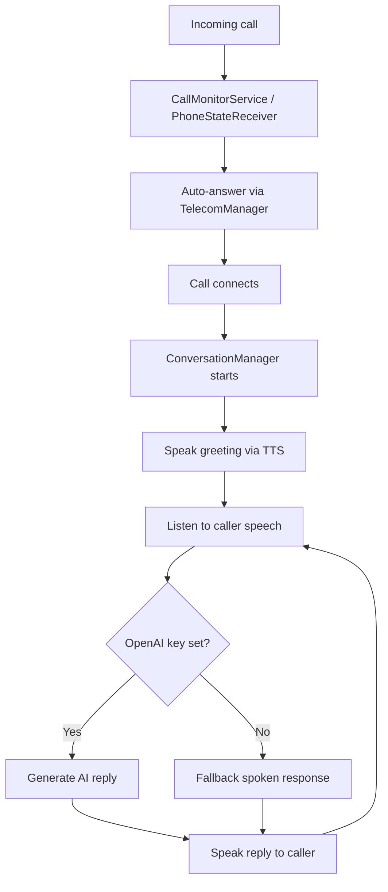

# Auto Call Answer

Android app that automatically answers incoming phone calls and speaks to the caller using text-to-speech, with optional AI-powered responses via OpenAI.

## Features

- Auto-answers incoming calls when enabled
- Speaks a configurable greeting through the phone call audio
- Listens for caller speech and generates AI replies (when an OpenAI API key is set)
- Foreground service keeps call monitoring reliable in the background
- Optional default phone app role for better call control on Android 10+

## Requirements

- Android 8.0+ (API 26), tested target SDK 35
- Physical Android phone with a SIM / cellular calling (emulators cannot test real calls)
- Android Studio Ladybug or newer
- OpenAI API key (optional, for AI conversation)

## Setup

1. Open this folder in Android Studio.
2. Let Gradle sync and download dependencies.
3. Connect a physical device with USB debugging enabled.
4. Build and run the `app` module.
5. In the app:
   - Grant phone, microphone, and notification permissions
   - Optionally set the app as the default phone app
   - Add your OpenAI API key
   - Customize the greeting message
   - Turn on **Enable auto-answer**

## How it works



1. A foreground service watches for ringing calls.
2. When a call arrives, the app answers it programmatically.
3. After the call connects, text-to-speech plays your greeting on the call audio path.
4. Speech recognition listens for the caller (speakerphone is enabled to improve pickup).
5. If an API key is configured, OpenAI generates short spoken responses.

## Important limitations

- **Manufacturer restrictions**: Samsung, Xiaomi, and other OEMs may block third-party apps from answering calls unless the app is the default dialer.
- **Android privacy**: Incoming phone numbers may be hidden from background apps on newer Android versions.
- **Call audio**: Speech recognition during a live cellular call is best-effort. Results vary by device and network audio routing.
- **Play Store policy**: Auto-answering call apps may face policy scrutiny; this project is intended for personal / development use.
- **Not a replacement for the system dialer UI**: The app focuses on answering and conversing, not full phone app functionality.

## Configuration

| Setting | Description |
|---------|-------------|
| Enable auto-answer | Master toggle for automatic answering |
| OpenAI API key | Enables AI-generated responses |
| Greeting message | First message spoken after answering |
| Default phone app | Recommended on Android 10+ for reliable answering |

## Project structure

- `service/CallMonitorService.kt` – foreground call watcher
- `service/CallResponderInCallService.kt` – in-call handling when default dialer
- `receiver/PhoneStateReceiver.kt` – phone state broadcast fallback
- `conversation/ConversationManager.kt` – greeting, AI, and TTS loop
- `ai/OpenAiClient.kt` – OpenAI Chat Completions client
- `speech/CallSpeaker.kt` – text-to-speech over voice call audio

## Build from command line

```bash
./gradlew assembleDebug
```

On Windows:

```bat
gradlew.bat assembleDebug
```

## Security note

Store your OpenAI API key only on your device. Do not commit API keys to git.
